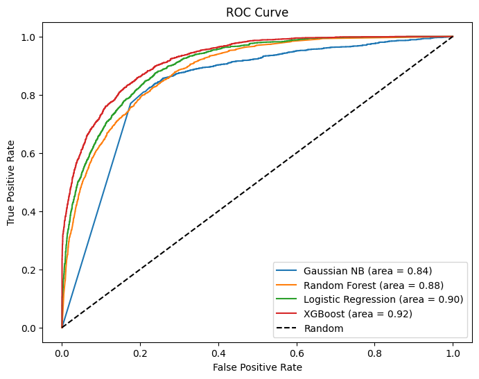

<h1>Predicting Income based on Census Data</h1>

A simple classification problem is solved using Machine Learning, where a prediction is made as to whether the income exceeds $50K/yr based on census data.

The following models were used for this project:

<li>Random Forest Classifier</li>
<li>Gaussian Naive Bayes Classifier</li>
<li>Logistic Regression</li>
<li>XGBoost Classifier</li>
 

The XGBoost Classifier proved to be the most efficient model, closely followed by the Logistic Regression model and the Random Forest Classifier.

The Gaussian Naive Bayes Classifier was not upto the level of the other three models as it provided an accuracy score of only about 60%

 

